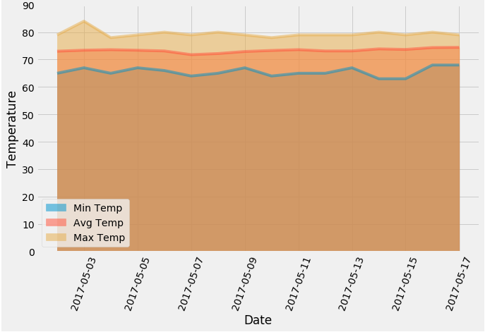
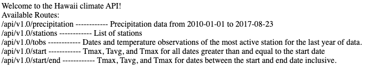

# sqlalchemy-challenge
The following project is focused: 
* First, on analysing and exploring climate weather conditions from Honolulu, Hawaii.
* And second, on designing a Flask API

## Features
* Advanced data storage and retrieval
* Data analysis and exploration of climate database using SQLAlchemy ORM queries, Pandas, and Matplotlib.

## Built with 

* Flask 

## Outcomes

### Area plot of Daily Rainfall average made with pandas
This was done by calculating daily normals (the averages for the min, avg, and max temperatures) from a specific date 

### Initial page of Climate API made with Flask
With the queries made from the initial analysis, a flask API was made with four routes of the most important climate data.

